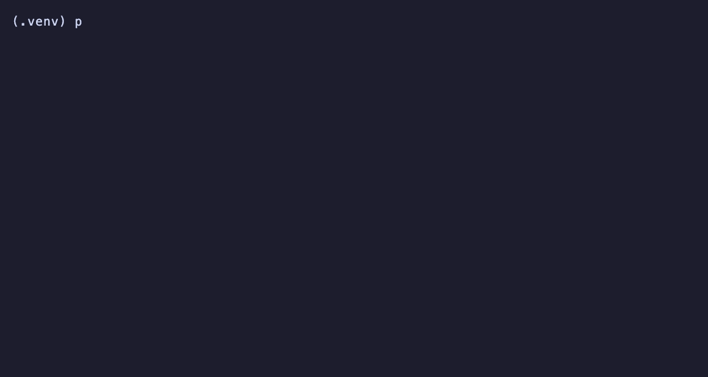

# SkillUp


**Train portable `SKILL.md` files that make your agent measurably better
at a task.** The model's weights stay exactly as they are, and the skill
loads into the harness you already run.



Point SkillUp at a dataset, an environment, or your own past
conversations. It rolls out episodes, distills what worked into a skill,
and keeps the result only when it beats baseline on held-out tasks it
never trained on. The output is a plain `SKILL.md`, the same file format
Claude Code, Codex, and OpenCode already read, so installing one is a
simple file copy.

**Validated with real numbers.** 10 environments, 3 models (one cheap,
two mid-tier), every result measured on data the skill never trained on.
[Does it work?](#does-it-work) states the results plainly: 7 of 10
environments show a real gain, and 3 land flat or negative, reported the
same way as the wins. Two real bugs in this repo's own code turned up
along the way, found by trusting a suspicious result over a convenient
one; the full postmortems are there too.

```bash
git clone https://github.com/shashank-yadav/skillup && cd skillup
./install.sh
export OPENROUTER_API_KEY=sk-or-...                          # https://openrouter.ai/keys
python install_skill.py --env frontend --best --target ~/.claude/skills
# -> installs a skill that took real-Jest-graded React component
#    pass rate from 85% to 91%. See "Use existing skills" for more.
```

SkillUp plugs into the agent harness you already run: Claude Code, Codex,
OpenCode, Cursor, or anything else that reads the Agent Skills
convention. Skills produced here are plain `SKILL.md` files in that same
convention (`<skills-dir>/<name>/SKILL.md`), so installing one is a file
copy. Point a harness with no native skill-loading at the file directly
and paste its body into a system prompt instead, the way
`core.agent.build_system_prompt` does internally. Compared to a
prompt-optimization library like DSPy or TextGrad, a trained skill here
is a static file you read directly, where those tools ask you to call
into their SDK.

---

## Contents

- [Install](#install)
- [Use it](#use-it)
- [Train a skill](#train-a-skill)
- [Does it work?](#does-it-work)
- [Does it hold up on a bigger model?](#does-it-hold-up-on-a-bigger-model)
- [Use existing skills](#use-existing-skills)
- [Manage a skill](#manage-a-skill)
- [Project structure](#project-structure)
- [Adding a new environment](#adding-a-new-environment)
- [Adding a new training algorithm](#adding-a-new-training-algorithm)

## Install

Point your agent at the repo and paste this:

```text
Clone https://github.com/shashank-yadav/skillup, run ./install.sh from
inside it, then check whether OPENROUTER_API_KEY is set in this shell.
If it isn't, ask me for it and export it. Tell me when you're ready.
```

`install.sh` creates a virtualenv, installs dependencies, and copies this
repo's two meta-skills into every agent skills directory it finds
(`~/.claude/skills`, `~/.codex/skills`, the shared `~/.agents/skills`
convention). It handles everything except your API key, which is why the
prompt above tells your agent to ask you for it directly. Rerunning it is
safe.

## Use it

Two meta-skills ship with this repo, so an agent that reads the Agent
Skills convention already knows what to do once installed: `skillup`
(train, evaluate, and manage skills) and `distill-conversation` (build a
skill from a conversation, callable mid-session). Ask in plain language:

- "Train a skill for MBPP and evaluate it."
- "Distill a skill from this conversation and save it as my-project."
- "Add a new environment for `<your dataset>` and train `gated` on it."

Everything below is what your agent runs on your behalf, useful for
running a step by hand or understanding what's happening.

## Train a skill

Training always follows the same loop, whatever the source: roll out
episodes under the current skill, distill what worked and didn't into a
candidate edit, validate the candidate against held-out tasks, keep it
only if it scores better. Five training algorithms ship out of the box,
from a single-shot distillation to a full port of Microsoft's published
SkillOpt method. Measure which one earns its keep before committing to
it; the only thing that changes between them is where the episodes come
from.

### From a dataset or environment

Point SkillUp at a coding benchmark, a QA dataset, an interactive
simulator, or any Hugging Face dataset. MBPP needs only an API key and the
core dependencies `./install.sh` already installed, so it's the fastest
way to see the whole pipeline run:

```bash
python collect_trajectories.py --env mbpp        # roll out the skill-less agent until quotas fill
python train_skill.py --env mbpp --strategy all  # distill a skill per strategy, one comparison pass
python evaluate_skill.py --env mbpp               # baseline + every trained variant, in parallel
python install_skill.py --env mbpp --strategy naive --target ~/.claude/skills
```

`evaluate_skill.py` writes `results/summary.json` (per-task detail) and
`results/summary.txt` (the printed table) under `experiments/mbpp/`. Model
choice lives in [config.yaml](config.yaml); everything MBPP-specific in
[experiments/mbpp/config.yaml](experiments/mbpp/config.yaml). Swap
`--env mbpp` for `--env searchqa`, `--env livemathbench`, or `--env
alfworld` (heavier setup: Python 3.9-3.11 and a multi-gigabyte download,
see [experiments/alfworld/config.yaml](experiments/alfworld/config.yaml)).
Iterate on a single strategy or condition directly:

```bash
python train_skill.py --env mbpp --strategy gated
python evaluate_skill.py --env mbpp --condition gated
```

### From your own conversations

Point `distill_conversation.py` directly at a transcript of a session
where you corrected your agent a few times, and it extracts the
generalizable lessons into a skill.

```bash
python distill_conversation.py --transcript conv.json --target ~/.claude/skills --name my-project
```

A transcript is a JSON list of `{"role", "content"}` turns, or plain
text, portable across any harness's log format. This is a single LLM
call: find corrections and confirmed successes, propose a bounded
add/remove insight edit, and apply it directly, the same ungated
accumulation design as `expel`. It extends
`~/.claude/skills/my-project/SKILL.md` if it exists, or creates it.
Callable mid-conversation ("remember this") through its own skill,
`.claude/skills/distill-conversation/SKILL.md` (also installed at
`~/.claude/skills/distill-conversation/`).

For a corpus of past conversations, validated the same way training
against a benchmark is:

```bash
python convert_conversation.py --transcripts conv1.json conv2.json ... --name my-project
python train_skill.py --env my-project --strategy gated
python evaluate_skill.py --env my-project
```

`gated`, `expel`, and `avo` apply here directly, since they only need a
fixed, pre-collected batch of episodes plus a held-out split, exactly
what a conversation corpus already is. `reflact` needs live rollouts
against a training split instead, so it sits out of this path (see
[Does it work?](#does-it-work)). `convert_conversation.py` segments each
transcript into episodes, split on corrections, so a mistake-then-fix
becomes a failure episode followed by a success episode, crediting the
correction itself rather than the conversation's ending. It holds some
episodes out, and points a generated `experiments/<name>/` at
`environments/conversation_judge` for the held-out portion: an
`Environment` whose `step()` asks an LLM judge whether a new response,
written under the candidate skill, corrects the mistake made last time
or still matches what worked, a judged proxy for re-running history on a
transcript that already happened. Because it's a normal `Environment`
plugin, `gated`, `core.trainer.dev_eval`, and `evaluate_skill.py` all
work against it unchanged.

### Through your own harness too

By default, every action-selection call goes straight to the model API
(`core/backend.py`'s `ApiBackend`). Pass `--harness cli` to route it
through an external harness's CLI instead, so trajectories, and the skill
distilled from them, reflect how that tool behaves:

```bash
python collect_trajectories.py --env mbpp --harness cli
python train_skill.py --env mbpp --strategy gated --harness cli
python evaluate_skill.py --env mbpp --harness cli
```

Needs `harness.cli.command` set in `config.yaml`: a shell template with
`{system_prompt}`/`{user_prompt}` placeholders, portable across any CLI
harness that accepts them. Verified end to end for Claude Code:

```yaml
harness:
  cli:
    command: >-
      claude -p {user_prompt} --system-prompt {system_prompt}
      --tools "" --no-session-persistence --output-format text
    timeout_s: 120
```

`--tools ""` and `--no-session-persistence` make Claude Code behave like
a plain chat completion: one clean action back per call, with tool-use
noise and leftover session state both stripped away. The same pattern
(print-and-exit, a forced system prompt, tools disabled) should carry
over to any similar CLI harness. Expect roughly 5-10x the latency of a
direct API call, with usage and token accounting coming from the CLI's
own output rather than the API response.

## Does it work?

Yes, on 3 of 4 benchmarks, measured on held-out data never seen during
training, every condition run under identical model, prompt, and step
settings so skill text is the only variable. Every number below is from
a small, cheap model (`google/gemini-2.5-flash-lite`), well below
frontier scale.

(A silent bug affected earlier versions of every number below except
ALFWorld/SearchQA/LiveMathematicianBench: `agent_max_tokens` defaulted to
64 everywhere, sized for those three benchmarks' short discrete answers,
and was truncating code and writing responses mid-output for MBPP,
BigCodeBench, SQL, Writing, and the conversation-distillation path,
inflating some results and flattening others. Fixed with per-environment
token budgets, and every number below reflects a clean re-run.)

| Benchmark | Baseline | Best result | Best strategy |
|---|---|---|---|
| ALFWorld (embodied household tasks) | 17.2% | **27.6%** (+10.4pp) | `expel` |
| SearchQA (trivia QA) | 50.0% | **74.0%** (+24.0pp) | `naive` |
| MBPP (Python programming) | 81.0% | 83.0% (+2.0pp) | `avo`/`reflact` (tied) |
| LiveMathematicianBench (research-level math MCQ) | 27.0% | 32.0% (+5.0pp) | `naive` |

LiveMathematicianBench's numbers reflect a second, unrelated fix: the
dataset's own `correct_choice` label is "A" for 100% of its 608 rows
(confirmed directly), and an earlier version of this environment's
option-assembly code sorted choices by that original label, meaning the
correct answer always rendered as option A: a 100%-reliable positional
exploit, plain and simple. One trainer strategy (`reflact`) partially
discovered it before the fix, inflating its measured gain on this
benchmark without any real improvement in reasoning behind it. Options are
now shuffled per-question with a reproducible seed and relabeled by their
new position; see `environments/livemathbench/env.py`.

`reflact` is a faithful port of Microsoft's published SkillOpt method (see
[reflact and avo](#reflact-and-avo-the-two-non-obvious-strategies) below).
Their own numbers on the same benchmarks, at frontier-model scale, show
larger gains for the same algorithm: LiveMathematicianBench **37.6% ->
66.9%** with GPT-5.5, and a SkillOpt-Lite variant reporting up to **+37.0pp**
on GPT-5.5. This repo verifies that method, plus four other strategies,
against a model you can afford to run at volume.

**Which strategy wins depends on the task.** `naive`, the simplest
strategy here, beat every more sophisticated method on two of four
benchmarks (SearchQA, LiveMathematicianBench); on MBPP, `avo` and
`reflact` tied for best. On the hardest benchmark (graduate-level math, a
different theorem every question) almost nothing helped, a real result
about that benchmark's difficulty. That's why five interchangeable
strategies ship: measure which one earns its complexity on your task.

**The conversation path earned its numbers the same way.** Run
end to end against 120 real conversations from the public
OpenAssistant/oasst2 dataset, standing in for "conversations you already
had": segmented into 157 episodes, 47 held out, scored by an LLM judge
(`environments/conversation_judge`) on 23 conversations never used for
training:

| Strategy | Held-out success | vs. baseline |
|---|---|---|
| Baseline (no skill) | 82.6% | n/a |
| `avo` | 87.0% | +4.3pp |
| `gated` | 87.0% | +4.3pp |
| `expel` | 82.6% | +0.0pp |
| `naive` | 82.6% | +0.0pp |
| `reflact` | not applicable | n/a |

`reflact` needs a live **train** split to roll out fresh episodes against
every step; a past conversation only provides the held-out
`valid_seen`/`valid_unseen` splits `convert_conversation.py` builds.

`avo` and `gated`, the two strategies that validate every candidate
against a held-out gate before keeping it, are the top performers here;
`naive` and `expel`'s ungated edits landed exactly on baseline. `avo`'s
insights are concrete and traceable (generated code should include its
imports and be runnable, explanations should be broken into numbered
steps); `gated`'s is a single targeted rule (cite a source directly when
asked for one). At n=23, one flipped task is 4.3 percentage points, so
treat this as directional rather than a precise measurement. Directional
is what the question needed: distilling from real conversations
measurably changes held-out performance.

**Three more domains were added to test how far this generalizes:**
`bigcodebench` (harder, more realistic Python problems), `sql`
(text-to-SQL, graded by executing the query against an in-memory SQLite
database and checking the actual result), and `writing` (quality across
genres, judged against expert-annotated reference pairs), trained and
evaluated the same way, on the same cheap model:

| Environment | Baseline | Best result | Best strategy |
|---|---|---|---|
| BigCodeBench (harder Python programming) | 28.0% | **34.0%** (+6.0pp) | `avo`/`expel` (tied) |
| SQL (text-to-SQL) | 57.0% | **59.0%** (+2.0pp) | `gated` |
| Writing (quality across genres) | 41.0% | 42.0% (+1.0pp) | `gated` |

BigCodeBench shows the clearest gain of the three, with sound, specific
insights behind it: validate a file path before opening it, check for
empty inputs and zero denominators before dividing. SQL and Writing moved
less. `gated`'s SQL insight is reasonable (use BETWEEN for inclusive date
ranges), edging out baseline by 2pp; part of that ceiling comes from the
dataset itself, since roughly 7% of its gold queries carry real
data-quality issues, the known cost of a synthetic set built to stay
fully self-contained (see `environments/sql/env.py`). SQL's number here
also reflects a real bug fix, covered in
[Does it hold up on a bigger model?](#does-it-hold-up-on-a-bigger-model)
below: what `core.agent.parse_action` was doing to every SQL query ending
in a string literal, and why the baseline itself moved from 37% to 57%
once fixed. Writing barely moved, and the "winning" insight has nothing
to do with writing quality itself, a tell that +1pp here is noise rather
than signal. A capable baseline that can already finish its response is
a high bar for generic writing advice to clear, and this result reflects
that difficulty honestly.

**Three more environments were added specifically to be practical,
skills people might actually want to install**: `frontend` (React
component implementation, graded by really running Jest, covered below),
`code_review` (real GitHub PR diffs from Microsoft's CodeReviewer corpus,
judged on whether the candidate's comment raises the same substantive
concern the real human reviewer did), and `humanized_writing` (matched
human-vs-AI answer pairs from HC3, judged on whether a response reads
like the human one). Same cheap model, same methodology:

| Environment | Baseline | Best result | Best strategy |
|---|---|---|---|
| Frontend (React + real Jest tests) | 85.0% | **91.0%** (+6.0pp) | `gated` |
| Code review (real PR diffs, LLM judge) | 45.0% | 46.0% (+1.0pp) | `expel` |
| Humanized writing (HC3, LLM judge) | 89.0% | 88.0% (-1.0pp) | `avo` (still worse than baseline) |

`frontend` is the clear win here, reported honestly as such: it's graded
by an actual `npm test`/Jest run against the candidate's component code
rather than an LLM judge, and the trained skill's advice is concrete and
checkable (match the test's exact label text and success/error strings,
and read the prop or route directly from the test instead of assuming
one). Code review barely moves: LLM-judging whether a comment raises the
same concern against real, messy PR diffs is a genuinely hard,
high-variance target, and +1pp on n=100 sits closer to noise than
signal. Humanized writing is a real negative result: baseline (the
model's own unprompted writing) already scores 89%, leaving little
headroom, and every trained strategy made it worse.

A pattern worth naming plainly across all three: trained skills
consistently push toward *longer* output, and that length rarely helps,
sometimes actively hurting instead. Code review's `naive` skill is the
extreme case: avg tokens/task went from 574 (baseline) to 6582, eleven
times longer, while success dropped to the worst score of any condition
(36%, against 45% baseline). Humanized writing showed the same shape at
smaller scale (422 to 881 tokens, -4pp). For judge-graded free-form
tasks specifically, "say more" is an easy local optimum for a training
loop to find and a bad one for a judge to reward: treat any trained
skill that inflates token count without a matching accuracy gain as
overfit.

Install the actual best-performing skill directly. It reads each
environment's published `summary.json` and only installs a strategy
that actually beat baseline:

```bash
python install_skill.py --env frontend --best --target ~/.claude/skills
python install_skill.py --env code_review --best --target ~/.claude/skills
python install_skill.py --env humanized_writing --best --target ~/.claude/skills
# -> refuses: no trained strategy beat baseline for humanized_writing
```

## Does it hold up on a bigger model?

Every benchmark above was re-run against two more capable models on
OpenRouter, `qwen/qwen3-235b-a22b-2507` and `deepseek/deepseek-v3.2`,
both 40-70x cheaper per token than a frontier model like GPT-5.5, to
check whether the story holds with more capability behind the wheel,
beyond the single small model above:

| Environment | Qwen: baseline -> best | DeepSeek: baseline -> best |
|---|---|---|
| ALFWorld | 41.8% -> **51.5%** (+9.7pp, `avo`/`naive`) | 29.1% -> **53.0%** (+23.9pp, `avo`) |
| SearchQA | 51.0% -> **68.0%** (+17.0pp, `naive`) | 61.0% -> **80.0%** (+19.0pp, `expel`) |
| LiveMathematicianBench | 37.0% -> **74.0%** (+37.0pp, `reflact`) | 35.0% -> **64.0%** (+29.0pp, `reflact`) |
| MBPP | 81.0% -> 85.0% (+4.0pp, `gated`) | 81.0% -> 83.0% (+2.0pp, `naive`) |
| BigCodeBench | 40.0% -> 40.0% (+0.0pp, `avo`/`gated`) | 43.0% -> 41.0% (-2.0pp, `avo`, best case) |
| SQL | 51.0% -> **60.0%** (+9.0pp, `avo`) | 63.0% -> 61.0% (-2.0pp, `expel`/`naive`, see below) |
| Writing | 50.0% -> **67.0%** (+17.0pp, `expel`) | 34.0% -> **53.0%** (+19.0pp, `naive`) |

`reflact`'s LiveMathematicianBench result holds up as a real pattern
across models: both bigger models show the same shape the cheap model
did (every simpler strategy flat or negative, `reflact` alone producing
a large, real gain). With the positional exploit fixed, this is the
clearest evidence in this repo that on-policy rollout with iterative
reflection earns its extra cost specifically on the hardest reasoning
tasks.

BigCodeBench flips from a clear win (cheap model, +6.0pp) to flat or
negative on both bigger models. The insights themselves stayed sound
(validate file paths, handle empty inputs); they simply stopped helping
once the baseline no longer needed the reminder, and for DeepSeek
actively got in the way. Same shape as the cheap-model Writing result
above: advice calibrated for a weaker model has to earn its keep again
on a stronger one.

DeepSeek's original SQL number was far worse (every skill condition 17
to 21 percentage points below baseline), and traced back to a real bug
in this repo's own code. Every generated response goes through
`core.agent.parse_action`, which strips leading and trailing quote
characters to handle a model that wraps its whole answer in quotes
(answering `"Margaret Atwood"` instead of `Margaret Atwood`). That logic
did `.strip('"').strip("'")`, stripping any leading or trailing run of
either quote character independently, rather than a matched wrapping
pair. A generated SQL query ending in a closed string literal, like
`WHERE city = 'Boston'`, ends in a quote character that belongs to the
query itself, and was getting its real closing quote silently stripped,
turning valid SQL into SQL missing its closing quote. Token budgets and
provider-specific flakiness were investigated first (finish_reason was
always `stop`, well under the completion limit, and every OpenRouter
provider serving this model individually showed the same low failure
rate on retest); the real cause turned up by comparing the actual
`core.agent.run_episode` code path against manual reproduction
attempts, which had been calling the API directly, entirely bypassing
the parsing step. Fixed to strip only a matched quote
pair wrapping the *entire* response, re-verified against both the
intended case (a wrapped short answer) and ALFWorld's discrete-command
matching before re-running. The fix alone closed nearly the entire gap:
from -17/-21pp before to -2 to -5pp after, the same modest range every
other model's SQL result falls in. This is shared code (`core/agent.py`)
that every free-form environment's response passes through; SQL was hit
hardest because a query ending in a quoted string literal is common,
though it's worth re-checking against every other environment's numbers
above too.

The cheap model and Qwen's own SQL results predated this fix as well,
and both were re-run once it landed. The cheap model's baseline moved
from 37% to 57% from the fix alone, with everything else about the run
unchanged; Qwen's moved less (53% to 51%, within normal run-to-run
noise) but its best result improved (+6pp before, +9pp after). Every SQL
number in this README reflects the fix.

**Does a skill trained by a bigger model help a smaller one?** Took
every skill DeepSeek trained above and ran the cheap model against the
same held-out tasks using DeepSeek's skill text instead of its own:

| Environment | Cheap model, own skill | Cheap model, using DeepSeek's skill |
|---|---|---|
| ALFWorld | 17.2% -> 27.6% (+10.4pp) | 18.7% -> 26.9% (+8.2pp) |
| SearchQA | 50.0% -> 74.0% (+24.0pp) | 47.0% -> **74.0%** (+27.0pp) |
| LiveMathematicianBench | 27.0% -> 32.0% (+5.0pp) | 28.0% -> **59.0%** (**+31.0pp**) |
| MBPP | 81.0% -> 83.0% (+2.0pp) | 82.0% -> 83.0% (+1.0pp) |
| BigCodeBench | 28.0% -> 34.0% (+6.0pp) | 34.0% -> 34.0% (+0.0pp) |
| SQL | 57.0% -> 59.0% (+2.0pp) | 57.0% -> 58.0% (+1.0pp) |
| Writing | 41.0% -> 42.0% (+1.0pp) | 44.0% -> 47.0% (+3.0pp) |

Most environments land close to self-training, sometimes a little
behind, sometimes (SearchQA) slightly ahead. LiveMathematicianBench is
the outlier that matters: the cheap model training on its own attempts
barely moves the needle (+5pp), a sign that distilling useful
mathematical-reasoning insights from its own failures sits past its
capability. Handed DeepSeek's insights instead, it jumps +31pp, larger
than DeepSeek's own gain on itself. *Generating* a good insight and
*following* one are different capabilities; a smaller model can be much
better at the second than the first, and this is the clearest evidence
in this repo of a skill transferring net-positive across that gap.

## Use existing skills

Every skill trained here, including every number above, is published
under `skills/<env>/<model-slug>/` alongside the results that validated
it, going further than just the code that produced it. Point your agent
at one directly, no training required:

```bash
cp skills/mbpp/google_gemini-2.5-flash-lite/SKILL.reflact.md ~/.claude/skills/mbpp/SKILL.md
```

`skills/<env>/<model-slug>/summary.txt` carries the exact numbers that
skill was validated against, so you can check the claim yourself. When a
skill fell short of baseline (BigCodeBench and SQL above), that's
visible right in its own directory.

The model shows up in the path on purpose: how a skill trained by one
model transfers to another varies, see
[Does it hold up on a bigger model?](#does-it-hold-up-on-a-bigger-model)
above, where the same skill that helps a small model sometimes does
nothing or actively hurts a bigger one. `publish_skills.py --env <name>
--model <id>` is the command that writes each one, run once after
`evaluate_skill.py`, so real numbers back every published skill.

Currently published, every environment under all three models
(`google_gemini-2.5-flash-lite`, `qwen_qwen3-235b-a22b-2507`,
`deepseek_deepseek-v3.2`): `alfworld`, `searchqa`, `mbpp`,
`livemathbench`, `bigcodebench`, `sql`, `writing`. New models land
alongside these as they're added. A fourth label,
`gemini-2.5-flash-lite_using_deepseek-v3.2_skills`, is also published for
every environment: the cheap model, unchanged, running DeepSeek's
trained skill text in place of its own, for the
[cross-model transfer results](#does-it-hold-up-on-a-bigger-model) above.
`frontend`, `code_review`, and `humanized_writing` are published for
`google_gemini-2.5-flash-lite` so far; check
[the practical-skills results](#does-it-work) above before installing
any of them. `install_skill.py --best` (below) only installs a skill
that actually beat baseline.

## Manage a skill

A skill's life continues well past training. Once one exists, it needs
to reach the harness you use, and stay reviewable and reversible as
it keeps changing.

### Install into your harness

Every skill this framework produces is a plain `SKILL.md`: frontmatter
plus a markdown body, the same shape Claude Code, Codex, OpenCode, and
the shared `~/.agents/skills` convention already read. It works as-is:

```bash
python install_skill.py --env mbpp --strategy naive --target ~/.claude/skills
python install_skill.py --env mbpp --strategy gated --target ~/.codex/skills --name mbpp-gated
python install_skill.py --env mbpp --strategy naive --target ./.claude/skills   # project-level
python install_skill.py --env frontend --best --target ~/.claude/skills        # whichever strategy scored highest
```

It looks first for a freshly local-trained skill under
`experiments/<env>/skills/`, then falls back to this repo's own published
copy under `skills/<env>/<model>/`, so this works right after a fresh
clone too. `--best` reads the published `summary.json` and picks the
strategy with the highest measured improvement over baseline, and
refuses outright if none beat it (see `humanized_writing` above), so
"the best" always means actually better than baseline.

For a harness with no native skill-loading, paste the file's body
directly into a system prompt, the way `core.agent.build_system_prompt`
does internally.

### Version, diff, rollback, merge

`install_skill.py` and `distill_conversation.py` both write through
`core/skill_store.py`, which versions every change to a deployed skill
with full-text snapshots in `<target>/<name>/.skillup/history.jsonl`,
since `~/.claude/skills` is usually a plain directory rather than a git
repo. Writing the exact same content twice is a no-op; a pre-existing
hand-edited skill gets adopted as v1 the first time something writes to
it.

```bash
python skill_manager.py list --target ~/.claude/skills
python skill_manager.py log my-project --target ~/.claude/skills
python skill_manager.py diff my-project --target ~/.claude/skills             # or --from N --to N
python skill_manager.py rollback my-project --target ~/.claude/skills --to 3  # writes a new version on top
python skill_manager.py merge other-name my-project --target ~/.claude/skills # fold one skill into another
```

`merge` exists for a specific failure mode: distilling the same project
under two different `--name`s by accident. It dedupes near-identical
insights the same way every trainer's crossover step does, and leaves the
source skill's directory in place unless you pass `--delete-src`.
Choosing *which* installed skill a harness loads for a given conversation
stays the harness's own job, matching each skill's `description`
frontmatter against what you're doing.

## Project structure

```
core/                    environment-agnostic framework
  environment.py           Environment protocol + registry
  agent.py                 the LLM agent loop (run_episode), environment-agnostic
  llm.py                   OpenAI-compatible chat client (targets OpenRouter)
  skill.py                 skill file I/O + insight-list helpers shared by trainers
  skill_store.py           version history for deployed skills (used by install/distill)
  conversation.py          transcript-formatting helper shared by the two conversation scripts
  trainer.py               TrainerContext + trainer registry + shared dev-eval helpers
  runner.py                process-based parallel episode runner

environments/            one subpackage per environment; each self-registers
  alfworld/env.py           ALFWorld plugin (wraps its TextWorld backend)
  mbpp/env.py               MBPP plugin (subprocess-sandboxed code-execution grading)
  bigcodebench/env.py       harder Python problems, same grading shape as mbpp
  sql/env.py                text-to-SQL, graded by real SQLite execution
  writing/env.py            writing quality, LLM-judge graded against chosen/rejected pairs
  humanized_writing/env.py  writing style, LLM-judge graded against human-vs-AI answer pairs
  code_review/env.py        real PR-diff review comments, LLM-judge graded against the real reviewer's
  frontend/env.py           React components, graded by really running Jest (js_project/, see below)
  conversation_judge/env.py LLM-as-judge plugin for convert_conversation.py's held-out episodes

trainers/                one module per training algorithm; each self-registers
  naive.py / gated.py / expel.py / avo.py / reflact.py
  prompts/                  each strategy's LLM prompt template

experiments/<env>/       one environment's config + generated scratch state
  config.yaml               task counts, split sizes, per-strategy knobs
  skills/, data/, results/  gitignored, generated by whichever model last ran
                            train_skill.py/evaluate_skill.py against this
                            environment, unlabeled by model, fully regenerable

skills/<env>/<model>/    published, labeled, committed: skills + the results
                          that validated them (see Use existing skills above),
                          the real reference, unlike the scratch copies above

collect_trajectories.py, train_skill.py, evaluate_skill.py    entry points
install_skill.py                                               drop a trained skill into any harness's skill dir
publish_skills.py                                               copy a trained skill + its results into skills/<env>/<model>/
distill_conversation.py, convert_conversation.py               build skills from conversations instead
skill_manager.py                                               list/show/log/diff/rollback/merge deployed skills
install.sh, requirements.txt, requirements-alfworld.txt,
  requirements-bigcodebench.txt                                 one-shot setup (see Install above)
  environments/frontend/js_project/                             one-time `npm install` for the frontend
                                                                    environment's Jest/React harness
                                                                    (`install.sh --with-frontend`)
```

## Adding a new environment

Implement `core.environment.Environment` in `environments/<name>/env.py`:

```python
class YourEnvironment:
    num_tasks: int
    def reset(self) -> tuple[str, dict]: ...                    # -> (observation, info)
    def step(self, action: str) -> tuple[str, bool, dict]: ...  # -> (observation, done, info)
    def close(self) -> None: ...
```

`info` must always carry the same four keys: `admissible_commands` (pass
`[]` for a single-turn, free-form-answer task with no fixed action
space, like QA or math; the agent loop switches to free text
automatically), `won` (meaningful once `done=True`), `task_id`, and
`task`. Everything environment-specific, a `__init__(self, config,
split, offset=0, count=None)` signature, quirky pseudo-commands, parsing
a task description out of raw text, stays inside your plugin.

Register it (`core.environment.register("yourname", YourEnvironment)`),
import the module from `environments/__init__.py`, add
`experiments/<yourname>/config.yaml` (copy ALFWorld's as a starting
point) and `skills/SKILL.initial.md`. `collect_trajectories.py --env
yourname` and friends work immediately after that.

`environments/hf_dataset/env.py` is a reference single-turn adapter for
any Hugging Face dataset with a prompt column and a reference-answer
column: point it at a dataset name and column names via config, with no
new code required (`pip install datasets`, kept optional since ALFWorld
doesn't need it). Custom grading or multi-turn interaction calls for
implementing `Environment` directly instead, like
`environments/mbpp/env.py` (subprocess code execution against test
assertions) or `environments/conversation_judge/env.py` (an LLM judge in
place of literal matching).

## Adding a new training algorithm

```python
def run(ctx: core.trainer.TrainerContext) -> dict:
    ...
    return {"skill": updated_skill_text, "history": [...]}
```

`TrainerContext` carries the LLM client, model settings, the current skill
text, training trajectories, a round count, and (for strategies that
validate candidates against held-out tasks) `dev_tasks` and everything
`core.trainer.dev_eval` needs to roll out fresh episodes. Reuse
`core.skill`'s helpers (`parse_insights`/`render_insights`/`apply_delta`)
for the same "preamble plus flat insight list, edited via small
structured deltas" representation the existing strategies use.
Full-document rewrites turned out fragile with cheap models (repetition
collapse, or copying the prompt's own context back as if it were an
edit); a bounded delta avoids that by merging in Python rather than
inside the model.

Register it (`core.trainer.register("yourname", run)`), import it from
`trainers/__init__.py`, and it's available via `--strategy yourname`.

---

## reflact and avo: the two non-obvious strategies

`reflact` (named after SkillOpt's own internal designation) replicates
Microsoft's published method rather than reinterpreting it: on-policy
rollout against the live `train` split every step, where every other
strategy here works from a fixed pre-collected batch instead, one
analyst call per minibatch of trajectories, hierarchical failure/success
patch aggregation, a cosine-decaying edit budget, gate tracking against
both a running "current" and a best-ever skill, and an epoch-boundary
"slow update" with its own protected skill region. Hyperparameters
default to SkillOpt's own published config (`batch_size=40`,
`minibatch_size=merge_batch_size=8`, `edit_budget: 4 -> 2`), verified by
running the upstream `microsoft/SkillOpt` repository against the same
cheap model used throughout this README: its gate rejected every step on
SearchQA, matching what `reflact` does here and confirming the port
reproduces the algorithm's real behavior, down to this specific quirk.

`avo` tracks whether the population's best dev score has improved each
generation. After `STAGNATION_PATIENCE` stagnant generations in a row, a
separate supervisor LLM call (`trainers/prompts/avo_supervisor.md`)
diagnoses why the population is stuck (converged lineages proposing
redundant edits, the same edit type repeatedly rejected, edits too timid
to escape a local optimum) and prescribes a directive that replaces the
normal bounded-edit instruction for every lineage until the population
improves again. This diagnosis is itself an agentic call; a static
exploratory-edit instruction steps in only if that call's response fails
to parse.

## Implementation notes

**Parallelization.** `core/runner.py` splits a condition's tasks into
`max_parallel_workers` (config.yaml) contiguous shards, each running in
its own OS process concurrently, combined in task order. Process-based
rather than thread-based on purpose: ALFWorld's PDDL backend (the `tatsu`
grammar parser) keeps shared, non-reentrant state that a concurrency
stress test found corrupts and crashes under multiple threads, even with
game-loading serialized behind a lock; separate processes each keep
their own memory instead.
`evaluate_skill.py --condition <label> [--shard-index I --shard-count N]`
exposes the same work as a single process/shard, for isolating a crash or
distributing shards across machines; `--merge` assembles a complete set of
shard files into the combined report.

**Experimental controls.** Training trajectories come from the `train`
split; evaluation uses `valid_unseen`, a disjoint set the skill cannot
have memorized. Every condition in `evaluate_skill.py` uses the same
model, temperature, max_tokens, and step budget: the only difference is
which skill text, if any, gets appended to the system prompt. Every
trajectory, in training and every eval condition, is saved to JSONL for
later inspection. Game-file ordering is sorted explicitly rather than
relying on filesystem traversal order, which was found to differ across
concurrently-running processes.
